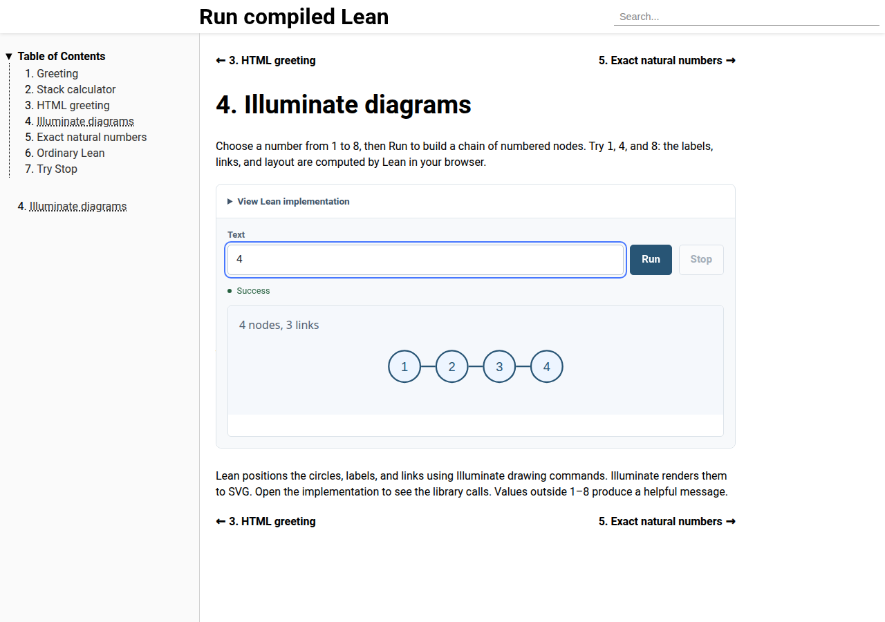

# verso-run

**Runnable Lean examples for Verso documents.**

Write a Lean function in your document, give readers an input, and let them
choose **Run**. The document build compiles the function; a dedicated browser
worker executes it through [VIR](https://github.com/ejgallego/lean-vir).
Readers need no Lean installation. **Stop** interrupts a running example.

[](https://github.com/ejgallego/verso-run/actions/workflows/ci.yml)

[Demo](https://ejgallego.github.io/verso-run/) ·
[Start your own manual](examples/manual-starter/README.md) ·
[Manual authoring](docs/authoring.md) ·
[Blog authoring](docs/blog.md) ·
[Slides authoring](docs/slides.md)



## Try it locally

Install [elan](https://github.com/leanprover/elan) and Python 3. The checkout selects
Lean 4.35.0-rc4 and fetches its compatible dependencies and runtime automatically.

```sh
git clone https://github.com/ejgallego/verso-run.git
cd verso-run
lake build
python3 scripts/build-demo-site.py
python3 -m http.server 8795 --bind 127.0.0.1 --directory _out/html-multi
```

Open [the landing page](http://127.0.0.1:8795/), choose Manual, Blog, or Slides,
change an input, and choose Run.
There are a few more examples to explore:

| Example | Try |
| --- | --- |
| [Stack calculator](http://127.0.0.1:8795/Stack-calculator/) | `6 7 * 2 +`, then `5 dup *` |
| [HTML greeting](http://127.0.0.1:8795/HTML-greeting/) | A name containing `<b>&` to see text escaping |
| [Illuminate diagrams](http://127.0.0.1:8795/Illuminate-diagrams/) | `1`, `4`, and `8` nodes |
| [Exact natural numbers](http://127.0.0.1:8795/Exact-natural-numbers/) | `9007199254740993` |
| [Try Stop](http://127.0.0.1:8795/Try-Stop/) | Start a large calculation, then interrupt it |
| [Blog page](http://127.0.0.1:8795/blog/page/) | Exact natural numbers from an imported source anchor |
| [Blog post](http://127.0.0.1:8795/blog/notes/2026-10-8-running-lean-in-a-post/) | Greetings, an HTML card, and Stop |
| [Slides](http://127.0.0.1:8795/slides/) | Run exact numbers and greetings, then navigate away to stop work |
| [Typed inputs](http://127.0.0.1:8795/Typed-inputs/) | Boolean choices and UInt64 maximum/wraparound |
| [Multiline text](http://127.0.0.1:8795/Multiline-text/) | Keep blank lines and number each line |

The combined site lives in `_out/html-multi`, with Blog under `blog/` and Slides under `slides/`.
Manual also generates `_out/html-single` and `_out/tex`.
To share a copy, see [hosting and packaging](docs/hosting.md).

## Add an example to your document

The [Manual starter](examples/manual-starter/README.md) is a small independent
project with everything wired together: a text function, a typed HTML card,
resource preparation, and a site generator. Copy it and edit its chapter.

The same runnable block syntax works in Manual, Blog Page/Post, and Slides:

````lean
```leanRun (entry := Demo.greet) (input := "Ada")
public def Demo.greet (name : String) : String :=
  "Hello, " ++ name ++ "!"
```
````

The authoring guide explains [imports, block options, HTML, and registration](docs/authoring.md).

## What works today

| Function | Reader input | Result |
| --- | --- | --- |
| `String → String` | Text | Plain text |
| `Nat → Nat` | An exact decimal natural number | An exact decimal natural number |
| `Bool → Bool` | A true/false selector | Plain `true` or `false` |
| `UInt64 → UInt64` | Exact decimal from 0 to 18446744073709551615 | Exact decimal; Lean arithmetic wraps |
| `String → Verso.Output.Html` | Text | An isolated HTML preview |

Functions must be public, executable, pure, and monomorphic, with one explicit
argument. Selecting `entry` registers the callable; no VIR attribute is needed.
VIR also checks their compiled dependencies. A supported function type
can still reach an operation absent from the runtime; the build will reject it.
See [troubleshooting](docs/troubleshooting.md) for examples and next steps.

String inputs can use `+multiline`: Enter adds a line break, and Ctrl+Enter or
⌘+Enter runs the example. All three genres share these controls and codecs.

This experimental release supports **Verso Manual**, **Blog Page/Post**, and **Slides**.
Manual examples can use inline definitions or
[checked source anchors from imported modules](docs/authoring.md#run-an-anchored-example-from-an-imported-module).
All three genres support inline definitions and optional checked anchors, including
automatic typed HTML adaptation; see [Blog authoring](docs/blog.md) and
[Slides authoring](docs/slides.md).
Readers edit function inputs; source editing
belongs to the future editor work. Ordinary highlighted Lean blocks keep working,
and source remains readable without JavaScript. Manual also retains its TeX output.

## Find your way around

The library lives in `src/`, browser assets in `web/`, and the complete three-genre
demo in `demo/`. The independent author project is in `examples/manual-starter/`;
acceptance checks and native reference executables live in `tests/`.


- [Authoring](docs/authoring.md): runnable blocks and typed HTML.
- [Blog authoring](docs/blog.md): runnable pages, posts, and site publication.
- [Slides authoring](docs/slides.md): native fragments, visibility-based Stop, and asset composition.
- [Troubleshooting](docs/troubleshooting.md): unsupported programs and build/runtime errors.
- [Internals](docs/internals.md): resource ownership, execution, limits, and exact pins.
- [Contributing](CONTRIBUTING.md): build, test, and repository layout.
- [Validation](docs/validation.md): qualification scope and retained evidence.
- [Multiple genres](docs/multi-genre.md): anchor review and shared/adapter design.
- [Roadmap](ROADMAP.md): upcoming diagnostics, anchors, genres, and integration work.

The project grew from a Verso prototype; its [development history](docs/history.md)
is retained. Licensed under [Apache-2.0](LICENSE).
